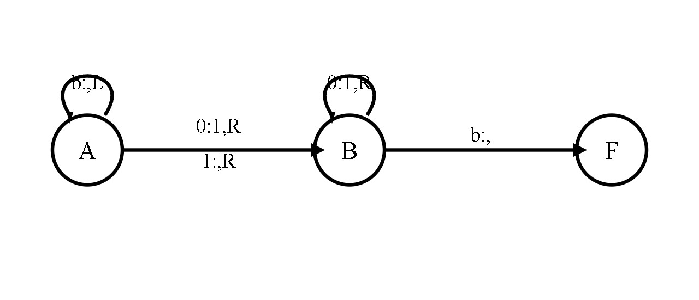
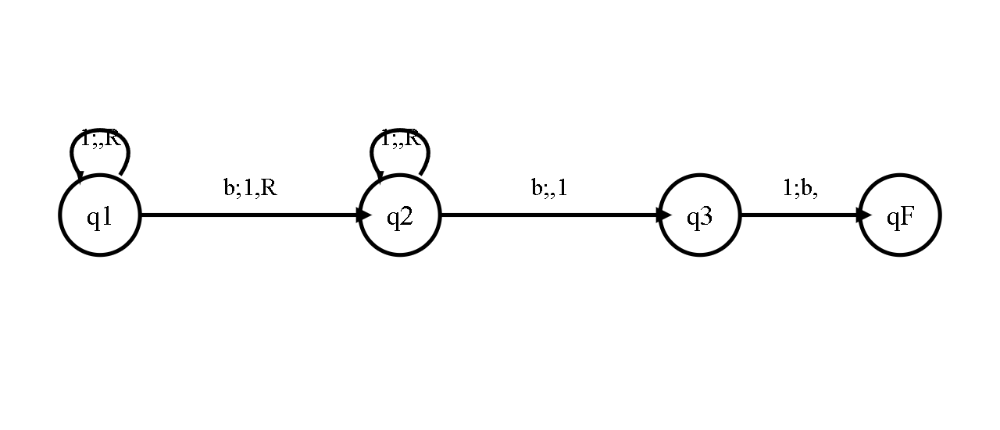
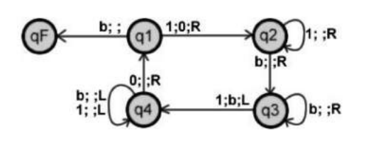
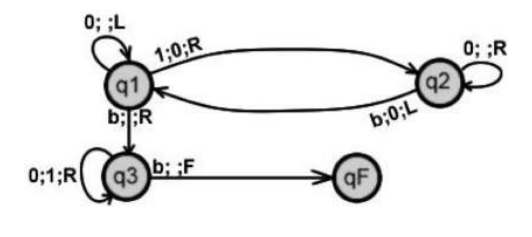

# Turing Machine Simulator

## Description
This project is a web-based simulation of a Turing machine. The Turing machine operates on a tape of binary data using a set of predefined instructions. Users can interactively explore the Turing machine's behavior and experiment with different programs, such as:
- Replacing binary digits (0 → 1)
- Adding unary numbers
- Subtracting unary numbers


## Features
- Simulate basic Turing machine operations such as replacing, adding, or subtracting binary digits.
- Predefined examples of Turing machine programs to quickly start with.
- Interactive user interface for controlling the tape, setting initial states, and manually stepping through the machine's operations.
- Customizable style and functionality to suit your needs.

## How to Use
1. Clone or download the repository to your local machine.
2. Open the `index.html` file in a browser to start using the Turing machine simulator.


## Technologies Used
- HTML
- CSS
- JavaScript


## Code Explanation
At the beginning of the code, you will find some styles. You can freely modify these styles as needed to change the appearance of the simulator.
```html
<style> ... </style>
```

The HTML page consists of two empty tables, which are dynamically generated using JavaScript to represent the tape and the program.

There are two input fields to provide the current state and the reading head position:
```html
<label>État : </label>
<input />
<label>Tête de lecture : </label>
<input />
```

After that we find two buttons:
1. "Suivant" Button: When clicked, it executes the turing() function, which performs the next step in the Turing machine's process.
```html
<button type="button" id="suiv" onclick="turing()">Suivant</button>
```
When we click the button, a function called `turing()` will execute. This function is responsible for the program:

```javascript
var turing = () => {
    // Get the current state and tape symbol to determine the next action
    var etat = document.getElementById("etat").value; // Current state
    var lecture = +document.getElementById("lecture").value + 10; // Current position on the tape (adjusted by +10)
    var c = document.getElementById("r" + lecture).value; // Current symbol on the tape at the current position

    // If the symbol is empty, default to "b"
    if (c == "") c = "b";

    // Find all input checkboxes that match the current state and tape symbol
    var programme = [...document.querySelectorAll("input")]
        .filter((i) => i.id.slice(0, 2) == etat + c && i.checked == true)
        .map((i) => i.id.slice(-1));

    // Determine what action to take based on the program rules
    var ecrire = programme.find((p) => CASES.includes(p)); // Determine what to write on the tape
    if (ecrire) document.getElementById("r" + lecture).value = ecrire == "b" ? "" : ecrire;

    var dep = programme.find((p) => "gd".includes(p)); // Determine direction to move (left or right)
    if (dep)
        document.getElementById("lecture").value = +document.getElementById("lecture").value + (dep == "g" ? -1 : 1);

    var etat_suiv = programme.find((p) => ETATS.includes(p)); // Determine next state
    if (etat_suiv) document.getElementById("etat").value = etat_suiv;

    couleurs(etat + c, document.getElementById("lecture").value); // Function to handle visual changes (not defined in the snippet)
};
```

2. "Auto" Button: When clicked, it starts automatic execution of the Turing machine. The button toggles between starting and stopping the automatic execution.
```html
<button type="button" id="suiv" onclick="turing()">Suivant</button>
``` 
The second button is automatic, which will make the Turing machine function run automatically:

```javascript
var auto = (e) => {
    // Check if the input argument e is "Auto"
    if (e == "Auto") {
        // Start automatic execution of the turing function every 500 milliseconds
        id_auto = setInterval(() => turing(), 500);

        // Change the button text to "Stop"
        document.getElementById("auto").innerText = "Stop";
    } else {
        // If e is not "Auto", stop the automatic execution
        clearInterval(id_auto);

        // Change the button text back to "Auto"
        document.getElementById("auto").innerText = "Auto";
    }
};
```

After the buttons, we have clickable links. When we click one of them, a function called `charger()` will be triggered, which takes an object property as a parameter, for example `exemples.A`:

```html
<ul>
    <li>
        <a href="#" onclick="charger(exemples.A)">Remplacer les 0 par des 1</a>
    </li>
</ul>
```

The `charger` function is used to load a specific state based on an example (`ex`). It resets the state, updates the tape, sets the machine's head position, and marks the relevant program rules as active (checked):

```javascript
var charger = (ex) => {
    // Clear the current state or reset the interface
    effacer(); // Likely a function that erases or resets the current setup

    // Set the machine's initial state
    document.getElementById("etat").value = ex.debut[0]; // Set the initial state of the Turing machine from ex.debut[0]

    // Set the initial position of the tape head (where the machine starts reading/writing)
    document.getElementById("lecture").value = ex.tete; // Set the head position from ex.tete

    // Load the initial tape content
    [...ex.debut[2]].forEach(
        (c, k) => {
            // For each character on the tape (ex.debut[2] contains the tape's initial content)
            // Set the value of the corresponding tape cell based on its position
            // If the character is 'b' (blank), the value is set to an empty string
            // Otherwise, the character itself is set as the value
            document.getElementById("r" + (ex.debut[1] + k + 10)).value = c == "b" ? "" : c;
        }
    );

    // Load the program rules (transitions) for the machine
    Object.entries(ex.programme).forEach(([l, p]) =>
        // For each entry in ex.programme (which contains the rules for the machine)
        // l is the key (state + symbol combination), p is the associated program (actions)
        [...p].forEach((c) => {
            // Mark the corresponding checkbox as "checked" (active) for the program rule
            document.getElementById(l + c).checked = true;
        })
    );

    // Apply the visual changes to the interface based on the initial state and head position
    couleurs(ex.debut[0] + ex.debut[2][0], ex.tete + ""); // Update colors or visual cues
};
```

The `exemples` object contains different configurations for Turing machine examples:

```javascript
var exemples = {
    A: {
        debut: ["A", 0, "001101"], // Initial state, tape start position, and tape content
        tete: -3,                  // Initial head position on the tape
        programme: {               // Program rules defining the machine's behavior
            Ab: "d",               // If in state A and reading blank ('b'), move right (d)
            A0: "B",               // If in state A and reading '0', transition to state B
            A1: "B",               // If in state A and reading '1', transition to state B
            B0: "1d",              // If in state B and reading '0', write '1' and move right (d)
            B1: "d",               // If in state B and reading '1', move right
            Bb: "F",               // If in state B and reading blank ('b'), transition to final state F
        },
    },
    // More examples like B, C, etc.
};
```






## Customization

You can easily customize both the appearance and functionality of the simulator:

### CSS Styling

To change the look and feel, modify the CSS rules in the `<style>` block located in the `<head>` section of the HTML file. You can change colors, fonts, button styles, and more.

### Adding Your Own Turing Machine Programs

You can add your own Turing machine programs by modifying the `exemples` object in the JavaScript section of the code. Each new example should follow the structure:

```javascript
var exemples = {
  CustomExample: {
    debut: ["A", 0, "your_initial_tape_content"],
    tete: 0, // Initial head position
    programme: {
      // Define the program's states and transitions
      A0: "B",  // State A reads 0, moves to state B
      A1: "d",  // State A reads 1, writes a 1 and moves right
      Bb: "F",  // State B finishes the execution
    },
  },
};
```

